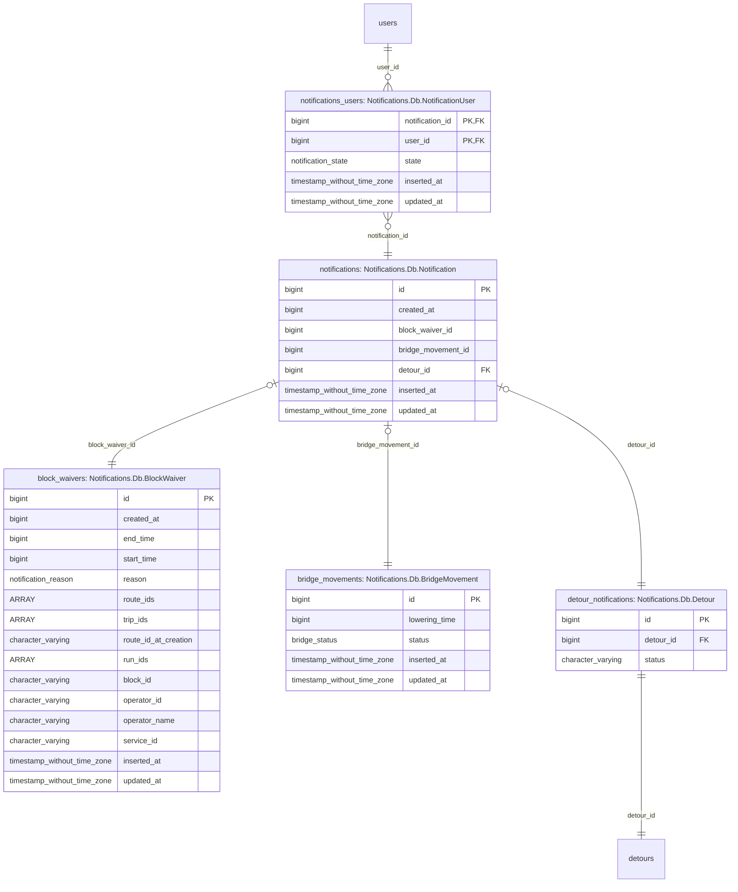

# 5. Detour Reminder Toasts Architecture

Date: 2025-04-22

## Status

Proposed

## Context
We're building the [Detour reminder toasts](https://app.asana.com/1/15492006741476/project/1203014709808707/task/1209497960717371) feature.
For this, we now need
- a way to track _when_ we should send notifications, which we have tentatively
    decided this will be the job of a new module named `Skate.Detours.Scheduler`
- a way to send notifications to the frontend, for which we _currently_ have
    modules in the `Notifications` namespace and `SkateWeb.NotificationsChannel`

One issue is that our existing notifications implementation under the
namespace of `Notifications`, which can be confusing or not straight forward
to understand.

To build this, we want a clear direction of what changes we'll be making and to
have how these systems will interact defined ahead of time in this document.

### Feature Requirements
#### User Requirements
1. Notification appears:
    1. 30 min in advance of the detour hitting estimated time end point
    1. when detour has hit estimated time point
1. Clicking notification opens the associated detour modal

#### Extended Requirements
There are some extended user requirements that are not specified in the AC of
the ticket, but are existing expectations of our current notifications system.

  1. Clicking the notification marks it as read.
  2. Past and Present Notifications are available in the "Notifications Panel".
  3. The latest notification appears in the top right hand corner of the screen 
      of the route ladders page.
  4. Notifications are delivered to active users immediately upon creation
  5. Notifications are stored and retrieved for users when they reload the
      application

### Current Notifications Implementation
We currently have a "polymorphic notification" system under the `Notifications`
namespace. This system handles Database CRUD operations, and realtime "PubSub"
functions.

Code wise, the core functionality of the existing notifications system is
provided by `Notifications.Notification` and `Notifications.NotificationServer`.

Additionally, we have `SkateWeb.NotificationsChannel` which is used to transmit
notifications to users, which is initiated and handled by the typescript
functions `useNotifications` and `useNotificationsReducer` on the frontend.

#### `Notifications.Notification` and `Notifications.NotificationServer`
`Notifications.Notification` is the "context" which handles interfacing with the
Database, converting Database objects into Domain objects but also handles
deduplicating "block waiver" and "bridge movement" notifications.

`Notifications.NotificationServer` is a GenServer responsible for delivering
notifications to users. But `NotificationServer` is also the module called in
the _creation_ of notifications.

In terms of responsibilities,
 - `Notifications.Notification` handles database CRUD responsibilities.
 - `Notifications.NotificationServer` handles realtime responsibilities.


#### `SkateWeb.NotificationsChannel`
This system is the "Phoenix Channel" which the frontend connects to over
a websocket to populate the notifications on the frontend. 

When the user opens the app and subsequently joins the `NotificationsChannel`,
the Channel 
1. retrieves and returns the
    `Notifications.Notification.unexpired_notifications_for_user/2` to initially
    populate the UI with existing notifications.
2. registers the channel process with the
    `Notifications.NotificationServer.subscribe/2` on behalf of the user, so
    that new notifications can be delivered to the user.

#### Database Structure
A notification in the database is a singular record which has
- an ID to identify the notification
- a `created_at` column for recording the time associated with the notification[^issues-with-created-at]
- `inserted_at` and `updated_at` timestamps provided by Ecto's `timestamps()` utility
- Columns with IDs (which _should_ be foreign keys) into other tables which
    enables a "polymorphic associations" relationship, so that we can have many
    types of notifications.

[^issues-with-created-at]: note(tech-debt):
  this is currently a `bigint` but it likely should be a `timestamp` in the database

There exists another table named `notifications_users`
(schema: `Notifications.Db.NotificationUser`) which joins a notification to a
set of users. Records in this table additionally record the "read state" of the
notification for the particular user.

So a notification is
1. inserted into table `notifications`,
2. joined to a set of users through `notifications_users`
3. and joined to a _single_[^single-notification-enforcement]
    "notification data" record via `belongs_to` association, which defines the
    notification's "type" and provides type specific data/attributes.

[^single-notification-enforcement]: note:
  the enforcement of having a single relationship is managed at the
  application/data access layer.



#### Notification Types and Publishing
There are currently 3 types of notifications
1. Block Waiver Notifications
2. Bridge Movement Notifications
3. Detour Activation/Deactivation Notifications

##### Background on Block Waivers and Bridge Movements
Block Waivers and Bridge Movements are polled from external sources by all
instances of Skate. Because multiple (uncoordinated) instances are trying to
fetch this information independently, there exists logic in
`Notifications.Notification` to check for existing notifications before creating
a new one in the database.

##### Detour Notifications
Unlike Block Waivers and Bridge Notifications, Detour notifications originate
from a single instance, rather than from multiple uncoordinated instances.

#### Sending to the frontend
`Notifications.Notification` has a function called `from_db_notification`, this
function converts from the "Database Object" to the "Domain Object" that is
passed to the frontend. This function coerces the Polymorphic Database Object
into a object structure that functions better with Typescript's default type
narrowing. The way this is done is by coalescing the different notification data
columns on the notification record
(ex: `block_waiver`, `bridge_movement`, `detour`) into a single field named
`content`. Then, by having a shared field for all values of `content`,
typescript is able to narrow the type without needing extra functions to help
narrow the type.

This was a [recent change to the notifications system to make it easier to deduce
the type in typescript](https://github.com/mbta/skate/pull/2773).
Before this change, the `reason` field was overloaded to function both as the
reason for a block waiver, but also to enable type narrowing and deduction to
tell the difference between a bridge notification and block waiver notification. 

## Decision
### Data Contracts
#### `Skate.Detours` -> `Skate.Detours.Scheduler`
When a detour change event happens, `Skate.Detours` shall call
`Skate.Detours.Scheduler` with the the detour that it is related to.

For events which create or update the notification time, then the computed
detour end time shall be provided as well as a `%DateTime{}`.

> [!NOTE]
> This makes `Skate.Detours` responsible for computing the end time so that the
> logic which interprets the data from the database is colocated, in the case
> that the valid values of `%Detour{ estimated_duration: <enum> }` change.

##### Event: Detour Activated
```elixir
iex> Skate.Detours.Scheduler.detour_activated(
...>   %Detour{
...>     id: <id>,
...>     estimated_duration: <duration string>
...>   },
...>   %DateTime{}
...> )
:ok
```
##### Event: Detour Deactivated
```elixir
iex> Skate.Detours.Scheduler.detour_deactivated(%Detour{id: <id>})
:ok
```
##### Event: Detour Duration Changed
```elixir
iex> Skate.Detours.Scheduler.detour_duration_changed(
...>   %Detour{
...>     id: <id>,
...>     estimated_duration: <duration string>
...>   },
...>   %DateTime{}
...> )
:ok
```


#### `Skate.Detours.Scheduler` -> Notifications System
When the configured activation time is reached for a detour, the `Scheduler`
should create and save a new notification and distribute the notification to
online users.
```elixir
iex> Skate.Notifications.create_detour_expiration_notification(%{
...>   # put the original detour as an FK association
...>   detour: detour,
...>   # store the _current_ estimated duration at this point in time
...>   estimated_duration: detour.estimated_duration,
...>   # 
...>   expires_at: %DateTime{}
...> })

%Skate.Notifications.Notification{
  detour_expiration: %Skate.Notifications.DetourExpiration{
    detour_id: ^detour.id,
    estimated_duration: ^detour.estimated_duration
    expires_at: %DateTime{},
    # [...]
  },
  # [...]
}
```

##### Challenges
Because a notification is a _point in time_, we'll need to save the
`estimatedDuration` and `expiresIn` information that the
`DetourExpirationNotification` frontend struct expects in another table,
because the `estimatedDuration` can change, which if we did not duplicate it
into the table used to store information for Detour Expiration Notifications
then when the duration changes _past_ notification's content would also change.

#### Notifications System -> `SkateWeb.NotificationsChannel`
Following the existing system, the "polymorphic association" form should be
transformed into a single `content` field with a `__struct__` field configured
for encoding to JSON as a discriminator for type narrowing on the TypeScript
side.
```elixir
%Skate.Notifications.Notification{
  # [...]
  content: %Skate.Notifications.DetourExpiration{
    detour_id: ^detour.id
    expires_in: %Duration{},
    estimated_duration: binary() # (?)

    # Virtual Fields resolved from the associated detour
    headsign: ^detour.headsign
    route: ^detour.route
    direction: ^detour.direction
    origin: ^detour.origin
  }
}
```

#### `SkateWeb.NotificationsChannel` -> Frontend
JSON Encoding of the object passed to the `NotificationsChannel`, wrapped with
JSON API[^json-api-convention] formatted `{"data": <content>}`, this is
encoded to JSON via the implementation of `Phoenix.Channel`.
```elixir
iex> %{
...>   data: %Skate.Notifications.Notification{
...>     content: %Skate.Notifications.DetourExpiration{}
...>   }
...> }
"""
{
  "data": {
    "content": {
      "__struct__": "Elixir.Skate.Notifications.DetourExpiration",
      // [...]
    },
    // [...]
  }
}
"""
```

[^json-api-convention]: This follows our current convention that we use when
  sending data over a Phoenix Channel

#### Frontend Current Expectations
The frontend component that renders notifications currently expects a struct of
the following shape:

https://github.com/mbta/skate/blob/2025-04-29-1/assets/src/realtime.ts#L113-L124  
[/assets/src/realtime.ts#L113-L124](/assets/src/realtime.ts#L113-L124)

```typescript
export type DetourExpirationNotification = {
  $type: NotificationType.DetourExpiration

  // Notification Information Fields
  expiresIn: ExpirationNotificationTime
  estimatedDuration: string

  // Detour Information Fields
  detourId: DetourId
  headsign: string
  route: string
  direction: string
  origin: string

  // TestGroup/Scope field
  isDispatcher: boolean
}
```

