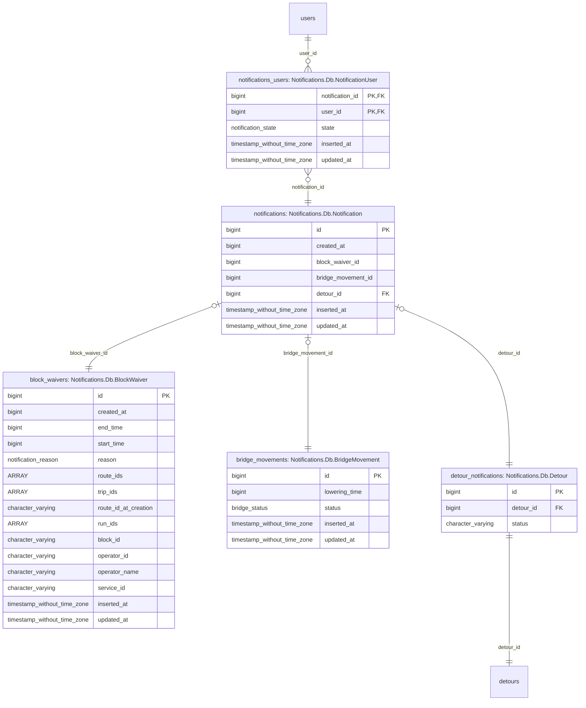

# 5. Detour Reminder Toasts Architecture

Date: 2025-04-22

## Status

Accepted

## Context
We're building the [Detour reminder toasts](https://app.asana.com/1/15492006741476/project/1203014709808707/task/1209497960717371) feature.
For this, we now need
- a way to track _when_ we should send notifications, which we have tentatively
    decided this will be the job of a new module named `Skate.Detours.Scheduler`
- a way to send notifications to the frontend, for which we _currently_ have
    modules in the `Notifications` namespace and `SkateWeb.NotificationsChannel`

One issue is that our existing notifications implementation under the
namespace of `Notifications`, which can be confusing or not straight forward
to understand.

To build this, we want a clear direction of what changes we'll be making and to
have how these systems will interact defined ahead of time in this document.

### Feature Requirements
#### User Requirements
1. Notification appears:[^notification-appearance]
    1. 30 min in advance of the detour hitting estimated time end point
    1. when detour has hit estimated time point
1. Clicking notification opens the associated detour modal

[^notification-appearance]: implementation note: I think we should avoid
  hardcoding these values, and would likely be best practice for us to treat
  these as variables from elixir Config, so that it's easy to change or add 
  more reminders in the future. For instance: if we later decide that we
  actually wanted to warn 30s before the end of the detour, instead of at the
  time the detour expires, changing this could be centralized in the `config`
  section, or eventually sourced from a database table configured in an admin
  interface using the same structure.

#### Extended Requirements
There are some extended user requirements that are not specified in the AC of
the ticket, but are existing expectations of our current notifications system.

  1. Clicking the notification marks it as read.
  2. Past and Present Notifications are available in the "Notifications Panel".
  3. The latest notification appears in the top right hand corner of the screen 
      of the route ladders page.
  4. Notifications are delivered to active users immediately upon creation
  5. Notifications are stored and retrieved for users when they reload the
      application

### Current Notifications Implementation
We currently have a "polymorphic notification" system under the `Notifications`
namespace. This system handles Database CRUD operations, and realtime "PubSub"
functions.

Code wise, the core functionality of the existing notifications system is
provided by `Notifications.Notification` and `Notifications.NotificationServer`.

Additionally, we have `SkateWeb.NotificationsChannel` which is used to transmit
notifications to users, which is initiated and handled by the typescript
functions `useNotifications` and `useNotificationsReducer` on the frontend.

#### `Notifications.Notification` and `Notifications.NotificationServer`
`Notifications.Notification` is the "context" which handles interfacing with the
Database, converting Database objects into Domain objects but also handles
deduplicating "block waiver" and "bridge movement" notifications.

`Notifications.NotificationServer` is a GenServer responsible for delivering
notifications to users. But `NotificationServer` is also the module called in
the _creation_ of notifications.

In terms of responsibilities,
 - `Notifications.Notification` handles database CRUD responsibilities.
 - `Notifications.NotificationServer` handles realtime responsibilities.


#### `SkateWeb.NotificationsChannel`
This system is the "Phoenix Channel" which the frontend connects to over
a websocket to populate the notifications on the frontend. 

When the user opens the app and subsequently joins the `NotificationsChannel`,
the Channel 
1. retrieves and returns the
    `Notifications.Notification.unexpired_notifications_for_user/2` to initially
    populate the UI with existing notifications.
2. registers the channel process with the
    `Notifications.NotificationServer.subscribe/2` on behalf of the user, so
    that new notifications can be delivered to the user.

#### Database Structure
A notification in the database is a singular record which has
- an ID to identify the notification
- a `created_at` column for recording the time associated with the notification[^issues-with-created-at]
- `inserted_at` and `updated_at` timestamps provided by Ecto's `timestamps()` utility
- Columns with IDs (which _should_ be foreign keys) into other tables which
    enables a "polymorphic associations" relationship, so that we can have many
    types of notifications.

[^issues-with-created-at]: note(tech-debt):
  this is currently a `bigint` but it likely should be a `timestamp` in the database

There exists another table named `notifications_users`
(schema: `Notifications.Db.NotificationUser`) which joins a notification to a
set of users. Records in this table additionally record the "read state" of the
notification for the particular user.

So a notification is
1. inserted into table `notifications`,
2. joined to a set of users through `notifications_users`
3. and joined to a _single_[^single-notification-enforcement]
    "notification data" record via `belongs_to` association, which defines the
    notification's "type" and provides type specific data/attributes.

[^single-notification-enforcement]: note:
  the enforcement of having a single relationship is managed at the
  application/data access layer.



#### Publishing
When the modules in `Notifications` were first created, Skate did not have
Distributed Elixir configured on any environment. Due to this restriction, when
a user session subscribed to notifications via `SkateWeb.NotificationsChannel`
each instance would have an independent lists of Phoenix Channels to send
notifications to based on which instance the user was connected to when they
connected to the channel. Due to this, when a new notification is broadcasted,
only the sessions connected to the instance broadcasting that notification would
receive the notification in realtime via their phoenix channel connection.

This works fine if all instances independently receive the event which triggers
the notification (such as polling an external API for changes) because the
polling can be tuned such that the time between when each instance becomes aware
of the event is relatively small and unnoticeable. But this does not work if the
event which triggers a notification originates from a single or subset of
instances, where the other instances will never receive the event.

> [!NOTE]
> Would be possible to use a database as a synchronization mechanism to allow
> instances to discover new notifications that need to be delivered, but
> this would be yet another way that notification delivery can be different
> per notification type.
>
> We've previously had issues with database IAM authentication stability
> with Postgres RDS and at the time did not trust the database enough
> to consider using the database as the synchronization mechanism. Now
> that we've addressed the database issues, it _may_ be worth reconsidering
> synchronizing via the database, _if_ `Phoenix.PubSub` is deemed not a good
> fit, as `Phoenix.PubSub` _could_ simplify thinking about subscription/delivery
> of notifications.

In the last year Skate has configured distributed Elixir for Production and
Dev environments. This was added to address the issue that notifications that
would originate from a single instance (Ex: a detour being activated by a user,
which is processed by a single instance). So now, when a Detour Activation
or Deactivation notification is created, Skate uses `GenServer.cast` to send
a message to other instances to let them know about new notifications that
need to be delivered. But this now means that there are two paths that could
be taken for delivering notifications to users.

Delivery to a specific subset of users was only lightly touched on in the
[Database Structure](#database-structure) section but is an important part of
the notifications implementation. The set of users that a notification is
created for and delivered to is dependant on the notification type and in some
cases based on what route ladders the user has open. The custom PubSub
implementation uses a [`Registry`][elixir-registry-docs] to store the
`Phoenix.Channel` and User ID of the user who opened the channel so that it can
filter which users the notification is delivered to.

[elixir-registry-docs]: https://hexdocs.pm/elixir/1.17.2/Registry.html#module-using-as-a-pubsub

#### Notification Types and Publishing
There are currently 3 types of notifications
1. Block Waiver Notifications
2. Bridge Movement Notifications
3. Detour Activation/Deactivation Notifications

##### Background on Block Waivers and Bridge Movements
Block Waivers and Bridge Movements are polled from external sources by all
instances of Skate. Because multiple (uncoordinated) instances are trying to
fetch this information independently, there exists logic in
`Notifications.Notification` to check for existing notifications in the database
before creating a new one.

##### Detour Notifications
Unlike Block Waivers and Bridge Notifications, Detour notifications originate
from a single instance, rather than from multiple uncoordinated instances.  As
stated in the [Publishing section](#publishing) Distributed Elixir was
configured for Skate so that Detour Notifications could be delivered to all
users when a Detour Status Change notification is created.

#### Sending to the frontend
`Notifications.Notification` has a function called `from_db_notification`, this
function converts from the "Database Object" to the "Domain Object" that is
passed to the frontend. This function coerces the Polymorphic Database Object
into a object structure that functions better with [Typescript's type narrowing
via Exhaustiveness checking][exhastiveness-checking]. The way this is done is
by coalescing the different notification data columns on the notification record
(ex: `block_waiver`, `bridge_movement`, `detour`) into a single field named
`content`. Then, by having a shared field for all values of `content`,
typescript is able to narrow the type without needing
[type predicates][type-predicates] to narrow the type.

[exhastiveness-checking]: https://www.typescriptlang.org/docs/handbook/2/narrowing.html#exhaustiveness-checking
[type-predicates]: https://www.typescriptlang.org/docs/handbook/2/narrowing.html#using-type-predicates

This was a [recent change to the notifications system to make it easier to
deduce the type in typescript](https://github.com/mbta/skate/pull/2773).
Before this change, the `reason` field was overloaded to function both as the
reason for a block waiver, but also to enable type narrowing and deduction to
tell the difference between a bridge notification and block waiver notification.

#### Marking Notifications as Read
When a notification is opened, the React `NotificationCard` triggers the
callback `openVPPForCurrentVehicle`, which sends the `TOGGLE_READ_STATE` event
to the `dispatch` function provided by the `NotificationsProvider` context.

When the "Mark all as read" button is pressed in the `NotificationsDrawer`
component, the `MARK_ALL_AS_READ` event is sent to the `dispatch` function
provided by the `NotificationsProvider` context.

Whichever way a notification is marked as read, the notification ids from the
events eventually make it to the `api.ts` function `putNotificationReadState`,
which is received by the `SkateWeb.NotificationReadStatesController` on the
backend. This controller uses `Notifications.Notification.update_read_states/3`
to mark certain `notification_user` records that have the notification ids as
read.

The frontend additionally updates it's own cached list of notifications and
marks them as read, which means the change in the database doesn't need to be
retransmitted to the frontend to update the UI to show notifications as read.

#### Pros and Cons of the current Implementation
##### Pros
The existing system is a decent start at a polymorphic notification structure,
although it is a bit messy with where certain logic lives. For instance: systems
that use and create notifications interact with
`Notifications.NotificationServer`, but systems that consume notifications
have to use `Notifications.Notification` to get existing notifications *and*
`Notifications.NotificationServer` to subscribe to new notifications.

Another bonus to this system is that it already exists and is integrated with
the frontend and has features such as per-user read state tracking.

##### Cons
There are a few issues with the current architecture, which would benefit from
being refactored or progressively ported to a new system.

While it is extensible, it can be somewhat annoying and time consuming to
understand how it's currently programmed to function, and coming back to the
notifications system after a period of time can result in needing to re-learn
how it functions, even for a developer with previous experience with the system.


###### Multiple Interfaces
Currently, functionality and API surface is split between `Notifications.Notification`
and `Notifications.NotificationServer`, this makes it difficult to know which
API is intended to be used and requires developers to first understand the
system before they're able to use it. It also is not straightforward to discover
why notification creators call into `Notifications.NotificationServer` instead
of `Notifications.Notification`, or why the API exists on these modules and
not the root namespace/module, `Notifications`.

###### Subscribing and Publishing Notifications
The current way that users subscribe to notifications involves each Skate
instance maintaining a `Registry` with the process and user ID of every
subscriber and using the `Registry` as a PubSub implementation. This
is described in more detail in the [Publishing section](#publishing).

The biggest benefit of the `Registry` implementation is that it makes
filtering notifications delivery based on the users intended to receive
the notification fairly straightforward. The downside is that sharing
notifications across instances was not considered when it was originally
built and we now have two code paths used when sending notifications.

Because we now have distributed Elixir configured, we could potentially use
`Phoenix.PubSub` for managing subscriptions, instead of our own homegrown
solution. This would be ideal, as it's a tried and tested solution and what
`Phoenix.Channel` is built on top of, and natively supports sending messages to
subscribers connected across a Erlang cluster along with many other benefits.

https://github.com/mbta/skate/blob/main/lib/notifications/notification_server.ex#L198-L211

The catch is that `Phoenix.PubSub` and `Phoenix.Channel` deliver to _everyone_
connected to that topic, whereas the notifications implementation has the
capability to deliver to a specific set of users, rather than to everyone. But
because users connect to a single "notifications" topic, and there is not
currently a _single_ shared factor that would easily identify all distinct sets
of users so that a user's Phoenix Channel could subscribe to a set of topics on
the user's behalf, we may need a custom way to filter delivery of notifications
when using Phoenix PubSub.

The [Phoenix PubSub documentation][phoenix-pub-sub-dispatcher-docs] states that
> `Phoenix.PubSub` allows developers to perform custom dispatching by passing a
> dispatcher module

[phoenix-pub-sub-dispatcher-docs]: https://hexdocs.pm/phoenix_pubsub/2.1.3/Phoenix.PubSub.html#module-custom-dispatching

and that

> You may want to use the dispatcher to perform special delivery for certain
> subscriptions. This can be done by passing the `:metadata` option during
> subscriptions.

So theoretically the user id could be passed to the subscription via `:metadata`
and the custom dispatcher for a notifications specific PubSub could filter which
users to send the notification to based on data provided to
`Phoenix.PubSub.broadcast` allowing a single instance to broadcast to all
connected users on all instances at the same time.

###### Misc Issues
1. [Anti-Patterns: namespace trespassing](https://hexdocs.pm/elixir/code-anti-patterns.html#namespace-trespassing)
    - The current Notifications system lives under the namespace `Notifications`
        this should instead live under the `Skate` namespace
1. Fixed expiration:
    - The current implementation assumes that a notification is only relevant if
        the notification's `created_at` value is within the last 8 hours. This
        has been a somewhat surprising behavior for Designers when reusing this
        system, although is not something we've heard any user feedback on.
1. Multiple formats in the Notifications API
    - This is something we've run into with other systems in Skate, which is
        that we seem to have a Database representation of an object but then
        also a "Domain Object" which the Database object is first turned
        into (Ex: `Skate.Settings.RouteTab` and `Skate.Settings.Db.RouteTab`,
        or `Skate.Detours.Detour` and `Skate.Detours.Db.Detour`)

        For Notifications, these two structs are `Notifications.Notification`
        and `Notifications.Db.Notification`. A more idiomatic way to construct
        may have been to have `Notifications.Notification` be the database
        representation and then have interfaces to this system (like,
        `SkateWeb.NotificationsChannel`) have their own representation
        which does the transformation outside of `Notifications`, like
        `%SkateWeb.NotificationsChannel.Notification{}`.
1. Get and Insert conflated
    - For block waivers and bridge movements, the functions which create new
        notifications aren't simple CRUD operations, but rather complex
        `get_or_insert` operations which try to insert and then look for
        the existing object based on other criteria if it fails to insert.
        Ideally, the Notifications context would have a simple interface for
        interacting with notifications and the logic for deduplicating
        bridge movement or block waiver notifications would live elsewhere.

        In the case of bridge movement and block waivers, they're using
        notifications for storing notifications to show to users in future
        sessions, but also to track status so that duplicates do not happen.
        So a better model may be to give block waivers and bridge movements
        their own tables/contexts/CRUD operations, which are linked via
        association when creating a notification record, and deduplicate
        separately before creating notifications.

## Decision
### Data Contracts
#### `Skate.Detours` -> `Skate.Detours.Scheduler`
When a detour change event happens, `Skate.Detours` shall call
`Skate.Detours.Scheduler` with the the detour that it is related to.

For events which create or update the notification time, then the computed
detour end time shall be provided as well as a `%DateTime{}`.

> [!NOTE]
> This makes `Skate.Detours` responsible for computing the end time so that the
> logic which interprets the data from the database is colocated, in the case
> that the valid values of `%Detour{ estimated_duration: <enum> }` change.

It is expected that the `Skate.Detours.Scheduler` will have it's own DB table
for tracking the Detours it may need to create notifications for and will
periodically poll this table for notifications to create. In theory, this
_could_ be the same table that the Notifications System joins a notification
to to provide the notification type.

##### Event: Detour Activated
```elixir
iex> Skate.Detours.Scheduler.detour_activated(
...>   %Detour{
...>     id: <id>,
...>     estimated_duration: <duration string>
...>   },
...>   %DateTime{}
...> )
:ok
```
##### Event: Detour Deactivated
```elixir
iex> Skate.Detours.Scheduler.detour_deactivated(%Detour{id: <id>})
:ok
```
##### Event: Detour Duration Changed
```elixir
iex> Skate.Detours.Scheduler.detour_duration_changed(
...>   %Detour{
...>     id: <id>,
...>     estimated_duration: <duration string>
...>   },
...>   %DateTime{}
...> )
:ok
```


#### `Skate.Detours.Scheduler` -> Notifications System
When the configured activation time is reached for a detour, the `Scheduler`
should create and save a new notification and distribute the notification to
online users.
```elixir
iex> Skate.Notifications.create_detour_expiration_notification(%{
...>   # put the original detour as an FK association
...>   detour: detour,
...>   # store the _current_ estimated duration at this point in time
...>   estimated_duration: detour.estimated_duration,
...>   # 
...>   expires_in: %Duration{}
...> })

%Skate.Notifications.Notification{
  detour_expiration: %Skate.Notifications.DetourExpiration{
    detour_id: ^detour.id,
    estimated_duration: ^detour.estimated_duration
    expires_in: %Duration{},
    # [...]
  },
  # [...]
}
```

##### Challenges
Because a notification is a _point in time_, we'll need to save the
`estimatedDuration` and `expiresIn` information that the
`DetourExpirationNotification` frontend struct expects in another table,
because the `estimatedDuration` can change, which if we did not duplicate it
into the table used to store information for Detour Expiration Notifications
then when the duration changes _past_ notification's content would also change.

#### Notifications System -> `SkateWeb.NotificationsChannel`
Following the existing system, the "polymorphic association" form should be
transformed into a single `content` field with a `__struct__` field configured
for encoding to JSON as a discriminator for type narrowing on the TypeScript
side.
```elixir
%Skate.Notifications.Notification{
  # [...]
  content: %Skate.Notifications.DetourExpiration{
    detour_id: ^detour.id
    expires_in: %Duration{},
    estimated_duration: binary() # (?)

    # Virtual Fields resolved from the associated detour
    headsign: ^detour.headsign
    route: ^detour.route
    direction: ^detour.direction
    origin: ^detour.origin
  }
}
```

#### `SkateWeb.NotificationsChannel` -> Frontend
JSON Encoding of the object passed to the `NotificationsChannel`, wrapped with
JSON API[^json-api-convention] formatted `{"data": <content>}`, this is
encoded to JSON via the implementation of `Phoenix.Channel`.
```elixir
iex> %{
...>   data: %Skate.Notifications.Notification{
...>     content: %Skate.Notifications.DetourExpiration{}
...>   }
...> }
"""
{
  "data": {
    "content": {
      "__struct__": "Elixir.Skate.Notifications.DetourExpiration",
      // [...]
    },
    // [...]
  }
}
"""
```

[^json-api-convention]: This follows our current convention that we use when
  sending data over a Phoenix Channel

#### Frontend Current Expectations
The frontend component that renders notifications currently expects a struct of
the following shape:

https://github.com/mbta/skate/blob/2025-04-29-1/assets/src/realtime.ts#L113-L124  
[/assets/src/realtime.ts#L113-L124](/assets/src/realtime.ts#L113-L124)

```typescript
export type DetourExpirationNotification = {
  $type: NotificationType.DetourExpiration

  // Notification Information Fields
  expiresIn: ExpirationNotificationTime
  estimatedDuration: string

  // Detour Information Fields
  detourId: DetourId
  headsign: string
  route: string
  direction: string
  origin: string

  // TestGroup/Scope field
  isDispatcher: boolean
}
```

##### Open Questions
1. We need to decide where the `isDispatcher` value should be sourced from:
    it could be sourced either on the backend or the frontend with
    our `inTestGroup` utility.
    1. Backend: we'd need to do database lookups for every user receiving a
        notification before sending it, and we'd likely need to do this in the
        `SkateWeb.NotificationsChannel`.
    2. Frontend: We already have the data on the frontend, which would be
        consistent with how the rest of the frontend is figuring out if the user
        is a dispatcher, but it does not _currently_ live update and continues
        to depend on test groups for RBAC.
2. We _could_ test/create a new convention where we encode as `camelCase` on the
    backend, rather than create `type Data<Struct Name> {[...]}`
    `type <Struct Name> {[...]}` and
    `function <Struct Name>FromData(data: Data<Struct Name>): <Struct Name>`
    on the frontend.


### Notifications Storage and Delivery Implementation
We can use the existing notifications system, with a few refactors to make
it a bit nicer to work with. These could be delayed, but while we are here
it would be worth improving.

If we build a entirely new system, it'd leave the desire for moving the
existing system to the new system. Using the existing notifications system
avoids needing to concern ourselves with a complicated double write and
backfilling process and having to tear down the old system after.

#### Path to adding Detour Expiration Notifications
Following the example set by Detour notifications:

Backend:
- Create a schema and table for `DetourExpirationNotification`
- Modify the existing notification schema and table to include fkeys to `DetourExpirationNotification`'s
- Hook into NotificationServer's broadcast logic that Detour Notifications use
  - May need to adjust how `broadcast_notification_to_other_instances`
      and `handle_cast({:broadcast_new_detour_notification, _})`, and
      `get_detour_notification` function, or create new functions
- Adjust the query in `unexpired_notifications_for_user` to return `DetourExpirationNotification`s
- Add `content_from_db_notification` implementation for `detour_expiration` notifications

Frontend:
- Add new type to `notificationData.ts`
- Parse the new type to the expected shape in `notificationFromData`
    (see [open questions](#open-questions) for some complications here)

#### Refactoring Recommendations
##### High Priority
1. Move logic for bridge movements and block waivers into own modules
1. Move notification creation logic from `Notifications.NotificationServer` to `Notifications`
1. Move notification subscription logic from `Notifications.NotificationServer` to `Notifications`
1. Move notification CRUD logic from `Notifications.Notification` to `Notifications`
1. Make Notifications CRUD API simpler

##### Medium Priority
1. Replace `Registry` PubSub implementation with `Phoenix.PubSub`
1. Move Notifications Database Object => Notifications Frontend Object
    conversion into own module
1. Fix namespace trespassing by migrating into the `Skate` namespace

##### Nice To Have
1. Add `expires_at` column to notifications and filter notifications by
    `expires_at` rather than fixed cutoff
1. Convert `created_at` to timestamp


## Consequences
This ADR describes an event based approach to tracking which detours
should be considered for creating expiration notifications for, where
the `Skate.Detours` module is responsible for notifying the `Scheduler`
of changes to a detour.  This does bring a risk that we'll fail to create
and send notifications to users if the application or BEAM process crashes
in the middle of processing the events.  Currently, this seems to be is
an acceptable tradeoff, and something that would be possible to refactor
later, once we have experience with this in production with users, we'll
be in a better position to determine if we need to reevaluate this decision
and rebuild that particular part.

See [using a polling based architecture section](#using-a-polling-based-architecture-instead-of-a-event-based-one)
for more details on alternatives to this that was considered.


## Alternatives Considered
### Using a polling based architecture instead of a Event based one
An idempotent system based on polling the detours database for active detours
that have matching expiration criteria was considered instead of an event
based approach; This was determined to be a bit more complex than we may
otherwise need because there is not a consistent criteria with our current
data to create queries that would easily and accurately find detours which
need notifications created.

Firstly, we do not have the expiration time stored as a column in the detours
schema at this time. We have avoided Refactoring or adding to the detours system
until we can come back and refactor or re-architect the system. If we wanted
to use the existing database to track state for the notifications, we have
to decide on the criteria by which detours are considered "notification ready".

_If_ we could create expiration notifications when the expiration time
is _exactly_ 30m or 0m away, then using this polling solution would work.
But because we have decided we'll still create and send notifications even
after we have missed the "proper window" for sending the notification (and
that we'll backdate the notification time) we need a solution that can track
if a notification has been sent for this _specific_ expiration time. Because
the expiration time can change, and we need to create new notifications
once the criteria is met for the new expiration time, the state that needs
to be tracked and queries that determine if a new notification should
be created are less straightforward than the event based solution.

